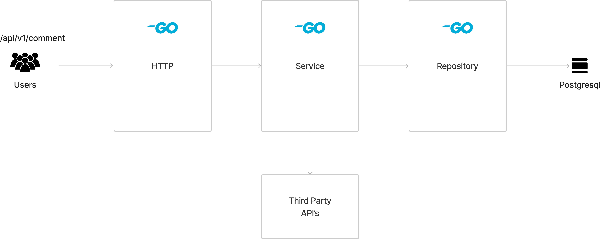

Go REST API Course
Well be building comments REST API with crud Operation(GET, READ, POST and DELETE Comments), Well be using Postgresql for External DB and packaged with docker and docker compose for running multiple services and adding a CI/CD Pipeline to  Build, Lint and Test and Deploy  Automatically 

## Tool Needed 
* Go Version
* Git Version
* docker -v
* docker compose -v
* task

## Project Architecture 

Now the way we're going to architect our application is we're going to define a series of layers

1. HTTP Layer: its responsible for everything at the transport level, so it's going to be responsible for validating the incoming request. It's then going to be responsible for marshaling that request into an object or a struct that our business layer or our service layer can interact with or can handle and manage. Now this HTTP layer of our application is not going to be responsible for any business logic within our application. It is going to be purely responsible for receiving incoming requests and ensuring that we're sending back the appropriate HTTP status codes and response bodies back to whatever client has called this service.

2. Service Layer:Now this service layer is responsible for only the business logic within our application. And by business logic I mean things like validating that the user has the right level of access to post a comment, validating that if we're deleting a comment, for example, that we're not allowing any user to delete anybody's comment, we're doing a wee bit of validation to ensure that the user id for the incoming request and the user id of the comment they want to delete is the same. Basically, things like that. Now if the business layer needs to retrieve information or interact with a store of some kind, it will then delegate this responsibility to a repository layer. Now this repository layer is going to be responsible for talking to the database.

3. Repository layer: In this example it's going to be a postgres database. So all of the code for interacting with the database will happen within this repository layer and all of the results will then be marshaled back into a response that the service layer can handle and then continue to process. Now this is just a simple example that has three layers and doesn't do any communication with any down party systems or APIs. However, we can easily extend this approach to interact with APIs in a way and still maintain our decoupled approach.